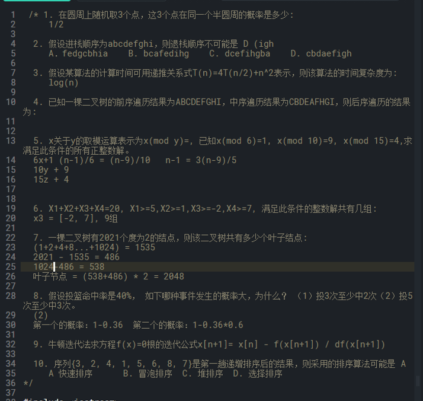
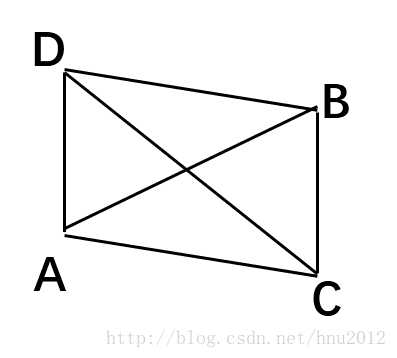
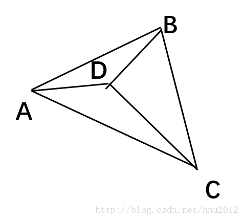

## ASML



JD:

As an algorithm research and development (R&D) team member, you will be responsible for designing, developing and testing algorithms that turn general requirement definitions into functioning software product. You will communicate and collaborate with other development team members in developing new products and functions while complying with Brion’s software development processes and procedures. You will be challenged with identifying problems and design robust solutions that are based on state of the art algorithm and software technologies.


Roles /Responsibilities:

\1. Develop and maintain computational lithography modeling and architecture codes in C/C++;

\2. Take on research, modeling and simulation of the physical process of lithography;

\3. Optimize codes and algorithm;

\4. Provide technical support of our products for world-wide customers.


Job requirements:

\1. Master or Ph.D. degree in engineering or science field, e.g. Mathematics, Physics, Computer Science, Software, Electrical Engineering;

\2. Proficiency in C/C++;

\3. Knowledge of numerical computation;

\4. Strong analytical skills and high creativity;

\5. Have strong sense of responsibility, good teamwork and communication skills

\6. Familiarity with UNIX environment, scripting languages will be a plus;

\7. Knowledge in semiconductor lithography and IC design will be a plus;


### Math与其他

向量点积，叉积

概率题：ABCDE求AB或AC或BC相邻的概率

线性规划题：上图第六题，220组，写代码得出来的。


计算几何（正方形碰撞，图像相关的面试题）

多边形碰撞：

   **step1:** PolyLine  多边形的边与多边形的碰撞检测，本质上是轮询多边形边，然后LineLine检测；

  LineLine



叉乘遵循右手定则，AB 和CD相交，AC->AB 叉乘结果是指向屏幕外，AB->AD也是指向屏幕外。两个叉乘结果的点乘肯定大于0；



如果如上图，AB,CD不相交，AC->AB指向屏幕外，AB->AD指向屏幕里，则不相交。

  **step 2:** PolyPoint 点与多边形，

​    

线与多边形碰撞：

ref: https://blog.csdn.net/u014389806/article/details/78057237

点与多边形碰撞


多边形与多边形碰撞


图像识别, 


### C++

虚函数的实现机制；

vector resize reserve的区别；stl的使用


### Algo

5个大于0的正整数之和为30的题解数量

for i = 1: 30

​    for j = 1: 30-i

​        for k = 1: 30-(i+j) ...

#### DP

**跳台阶扩展**

一只青蛙一次可以跳上1级台阶，也可以跳上2级……它也可以跳上n级。求该青蛙跳上一个n级的台阶(n为正整数)总共有多少种跳法。


**字符串全排列**

输入一个字符串，打印出该字符串中字符的所有排列，你可以以任意顺序返回这个字符串数组。例如输入字符串abc,则按字典序打印出由字符a,b,c所能排列出来的所有字符串abc,acb,bac,bca,cab和cba。


**连续的最大子集和**


#### 排序

**数据流中的中位数**


扩展：滑动窗口的最大值

单调队列，deque, 新的大值将旧的直接替换掉。

> 则让当前元素和容器的最后一个元素比较，如果大于，则将容器的最后一个元素删除，然后继续讲当前元素和容器的最后一个元素比较


**栈的压入、弹出**

输入两个整数序列，第一个序列表示栈的压入顺序，请判断第二个序列是否可能为该栈的弹出顺序。假设压入栈的所有数字均不相等。例如序列1,2,3,4,5是某栈的压入顺序，序列4,5,3,2,1是该压栈序列对应的一个弹出序列，但4,3,5,1,2就不可能是该压栈序列的弹出序列。（注意：这两个序列的长度是相等的）

HINTS: 

模拟法：stack(1,2,3,5) 

​    map(1,2,3,4)


## ST

1.负责自动驾驶项目中，预测、行为规划、全局路径规划、局部路径规划算法研发、调试、测试；

2.负责与其他专业组一起紧密配合，将相关算法实际项目应用落地，最终达到任务、项目目标任职要求


*精通linux环境下C++编程，具有良好的代码习惯

熟悉规划或者轨迹生成算法（A*,RRT,RRT*）以及决策优化相关模型（MDP,POMDP等）

熟悉车辆动力学及控制方法

有良好的数学基础及凸优化相关的知识优先考虑：

有量产ADAS规划控制功能开发经验，如高速辅助驾驶功能

有在车规级计算平台上基于C++规划控制算法开发经验优先


1.首先作为自动驾驶从业人员一定要学习自动驾驶平台，如开源的百度apollo，apollo具有大量的开源资料和仿真平台，为无车的大家提供了一个很好的学习平台，通过apollo可以了解自动驾驶软件架构和各模块代码。

2.基础工具：熟练使用linux，ros，rviz，docker，cmake，git，gdb等工具，工欲善其事，必先利其器。


3.代码能力提升：熟练掌握C++，可以通过练习leetcode代码提升能力，掌握C++数据结构。


4.规划算法学习：A*，hybird a star，RRT，Dijkstra，多项式，贝塞尔，b样条，RS曲线，dubins曲线，圆弧曲线，螺旋曲线等。


5.控制算法学习：MPC，LQR，模糊控制，PID等

Lattice planner、EM Planner、Bezier


6.计算几何:向量，标量，矩阵，坐标转换，碰撞检测，曲线，直线相交，点到线距离等。


7.数值优化：梯度下降，QP，序列二次规划等


8.决策理论：POMDP，MDP，状态机，决策树，贝叶斯理论等。

MDP


9.博弈论：纳什均衡等

10..车辆动力学和运动学模型。

11.策略迭代的学习方法：Qlearning等方法。

12.熟悉交通规则和驾驶能力。

13.还有一些仿真工具，如百度，carla，sumo等


设计模式：工厂模式，apollo相关的设计模式

leetcode：dp

c++ 动态绑定，fsm实现。红黑树

apollo 源码：


```
0.4*0.4*0.4+ 3*0.6*0.4*0.4
```


