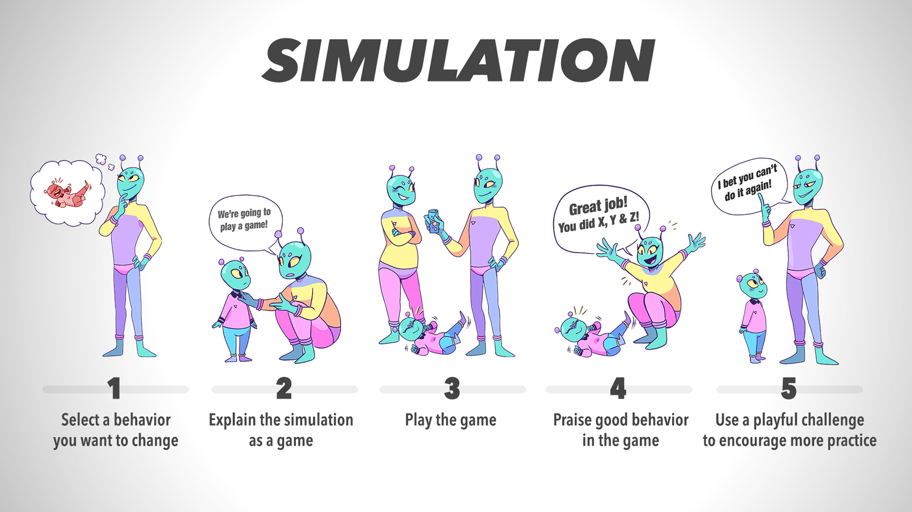

铺垫的方式：具体+温和+提供选择+客气一点+提供帮助+提出挑战

Behavior: shaping + simulation + modeling

shaping: 开始的一小步，例如第一次叫妈妈，第一次走路，其实我们都是采用了下述的flow，只是没有察觉而已。从一件小事做起，最后完成的是整体行为的改变。当然也可以采用上述铺垫的方法来帮助孩子走出第一步，例如“我赌你不能收起你的玩具”，“让爸爸来帮助你收玩具吧~”

step1很重要，要尽可能的具体，例如要孩子玩完玩具后自己收起来，要孩子按时在餐桌上吃饭etc。

simulation: 例如孩子喜欢用手抹眼角，就跟她玩闭眼睛、拿湿巾擦眼睛的游戏。

改变行为的方式有很多，但每天尽可能的重复，重复次数在一周以上，来保证数量能达到改变行为的目的。

modeling: 例如不要说脏话；任何一个改变行为的榜样，都需要多加练习

modeling是最基础的一种学习方法，也有助于培养孩子的观察能力；一开始要选择一个好的习惯或特性，例如按时吃饭；同时去驱使孩子去模仿家长的行为。

激发孩子想象力的三种方法：1. 放置一些能激发创意的玩具，例如积木或者[littleBits 电子发明音乐套件](https://www.amazon.cn/dp/B07BFNLKY2/ref=cbw_us_cn_dp_ags?smid=A2EDK7H33M5FFG); 2. 激发创意，鼓励一些奇怪或天马行空的想法，例如画一个绿色的太阳；3. 不要自我设限(self-screening), 家长也不要排斥一些愚蠢的问题。当然，家长也需要给孩子的行为设置限度，孩子需要想象力，同时也需要完成自己的家庭作业。

我们对孩子的期望是建立在自己不清晰的童年记忆、他人的孩子以及道听途说的内容之上的；如何达到塑造孩子行为的结果呢?

首先，通过逐步走向成功来培养能力，并关注过程而不是成功的结果：也就是说，专注于尝试做有价值的事情，而不是立即达到你认为这个年龄的孩子应该达到的表现水平。如果你遇到了强烈的阻力，那就退后几天，当你回到问题上时，降低你的要求。寻求在更短的时间内获得所需的行为，要求更少，或者采取其他措施来消除要么全有要么全无的动态。以可行的步骤逐步达到所需的行为，这是一个称为塑造的过程。不要将失败的后果来影响你塑造过程中的努力，因为你的压力会增加，孩子的压力也会增加。

或者重新考虑你的要求中哪些是至关重要的，哪些是可以协商的。当你的孩子不能满足一个合理、具体、明确、灵活的要求，而且这是一次性的，如果可以的话，试着放手。但是，如果请求没有得到满足，而且这不是一次性事件，那么是时候开始塑造所需的行为了。从你最终会满足的更少开始：更少的行为，更少的时间，更少的频率。十分钟的家庭作业，而不是一整小时的作业；请记住，让一种行为在大多数时候发生，而不是每次发生，可能就足够了。例外情况通常不是问题；它们很正常。就像你自己努力锻炼和正确饮食一样，如果这是一种习惯，如果你大部分时间都这样做，那就足够了。

同时，童年的习惯并不会完全的为孩子未来的生活习惯设定模式，因此，不要把孩子的每一个行为都变成滑坡或者预演，从未增加不必要的压力。

最后，请记住胆固醇中风的警告，或者U型关系的原理。胆固醇高或低的人患中风的风险较高，而胆固醇居中的人风险最低。它可以与预期相同。混乱（压根没有期望：整天自由地看电视和玩游戏，想睡觉就睡etc）和管制（太多不合理的期望，对可变性的考虑太少，打击式的教育）都会给孩子和家庭带来负面的压力。但在每种情况下，诀窍都是找到U型的中间点，即期望太少和太多之间的点。

对于孩子违反指令的行为，家长最好的反应是忽略它，而不是冲着孩子大吼大叫。因为negative行为只会导致孩子增加其防御心理，而不是对其行为有所反思。

我们的大脑总是倾向于抓住我们不喜欢的一些特质，并放大它，这种叫negativity bias消极偏见。因此，面对孩子一些不好的习惯，我们可以用以下方法来改变其行为：

注意，习惯的改变是个相对比较漫长的过程，一般在3周之久。

#### 积分系统

利用积分来奖励孩子的行为，而且这个行为是非常具体的。

积分情况以及奖励可以展示在冰箱这种日常能见到的地方。需要限制每天最多可以赚取多少”星星“。每赚一个星星，都要鼓励。即使没获取星星，也要鼓励明天接着来。

一开始不要太难，也不要定一个太大的目标。

#### attending & planned ignoring

多注意，表扬好的方面；有意的忽视差的方面。

有意识忽视不是为了改变某个行为，而是防止负面的行为加剧。

多加注意并鼓励好的行为，故意忽视差的行为，越大的反差才能更好地激励孩子。注意：Attending can be effective without the use of planned ignoring, but planned ignoring can not be effective without attending. 正向的鼓励才嫩改变行为。

