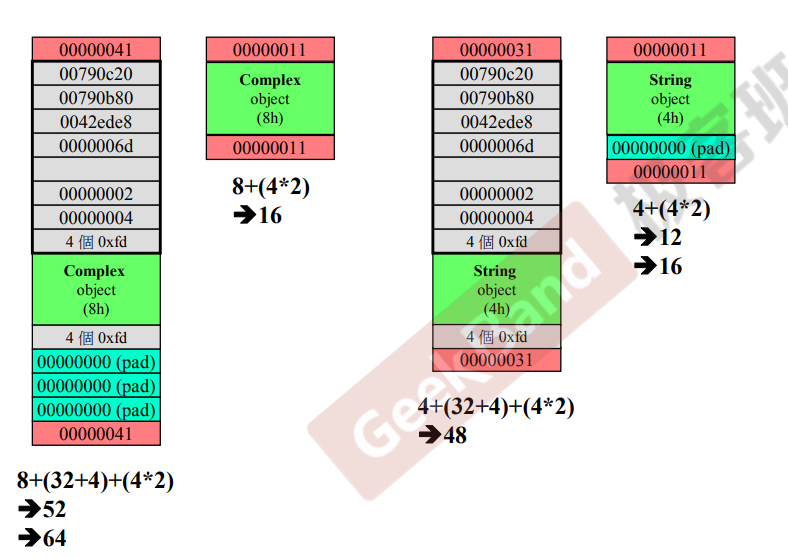
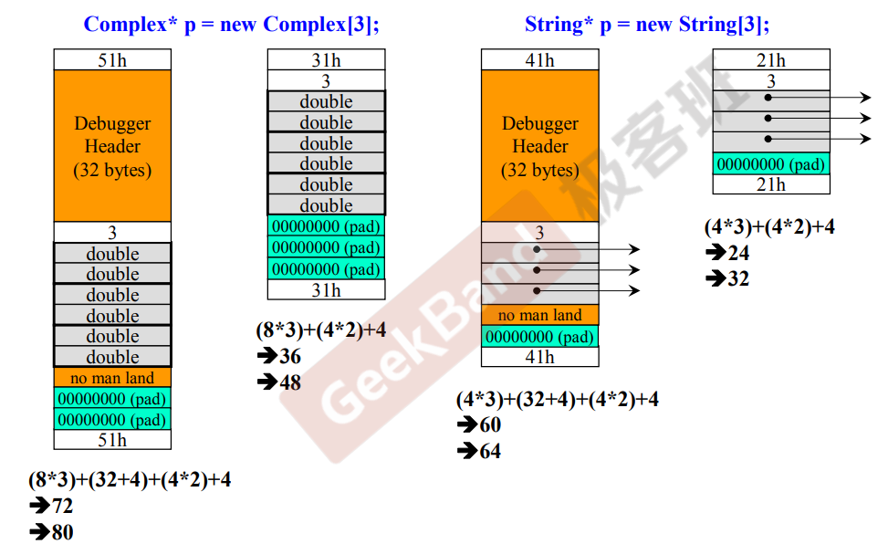

笔记补充的材料：

https://github.com/Light-City/CPlusPlusThings


## Baisc

### 1. complex class

#### guard

这玩意叫guard，防卫式声明。

```c++
#ifndef MY_H
#define MY_H

#endif
```


#### initialization

```c++
complex(double r=0, double i=0) : re(r), im(i) {
    // TODO
}
```

一个变量分为两个阶段，初始化+赋值，复制构造函数中最好使用列表初始化这种写法。


#### 函数重载

编译器中会默认加些id来区分同名函数：

```c++
double Complex::real() const {}
void Complex::real(double& re) const{}

// 编译器中
?real@Complex@@QBENXZ
?real@Complex@@QAENABN@Z
```


#### const member functions

```c++
// 1. non-const
double complex::real () {return re;}
// 2. const
double complex::real const () {return re;}

// 第一种在下述语句中会报错
const complex c1(2,1);
cout << c1.real();
```


#### friend class

类可以访问当前类为形参的私有变量，eg:

```c++
class sample{
public:
    inline void add_other(const sample& other) {
        this->ga += other.ga;
    }
private:
    int ga;
};
```

原因是同一个类之间互为友元。


#### 运算符重载

重载符号时最后将某些操作包一层,例如`__doapl`，其他地方可能用到：

```c++
inline complex& complex::operator += (const complex& r) {
    return __doapl(this, r);
}

inline complex& __doapl(complex& ths, const complex& r) {
    ths->re += r.re;
    ths->im += r.im;
    return *ths;
}
```


`ostream`是`cout`的类型

```c++
// cout overloading 
ostream& operator << (ostream& os, const complex& x) {
  return os << "(" << real(x) <<  "," << imag(x) << ")";
}
```

之所以要返回`ostream&`是因为需要满足`cout << c1 << c2 << endl`这类连续输出的场景。


### 2. string class

#### construct

```c++
class string {
public:
  inline string(const char* cstr){
    if(cstr) {
      data_ = new char[strlen(cstr)+1];
      strcpy(data_, cstr);
    }
    else {
      data_ = new char[1];
      *data_ = '\0';
    }
  }
  
  inline ~string() {
    delete[] data_;
  }
private:
  char *data_;
};
```


#### 拷贝赋值copy assignment

```c++
inline string& string::operator=(const string& str) {
  if(this == str) // detect self assignment
     return *this;
  delete[] data_;
  data_ = new char[strlen(str.data_)]
  strcpy(data_,str.data_);
  return *this;
}
```

如果没有检测自我复制，那么`delete[]` 操作把自己干掉了，那后续copy操作就会失败。

之所以返回string&而不是void，是为了适应下面这类连续赋值的用法：

```c++
string gaga("gaga");
string ga = gagaga = gaga;
```


#### heap, stack

stack有作用域，函数调度时本身就会生成一个stack。heap是操作系统提供的一块global的内存空间，程序能动态分配从中获得若干块。

stack的生命周期在离开作用域后会自动释放。static 的local object则会伴随程序一直存在。global objects则是写在main之外的变量，和static是等价的。

heap的周期则是delete时才会结束。

```c++
complex* pc = new complex(1,2);

// 编译器将上述操作解析为三步操作
void* mem = operator new(sizeof(complex)); // malloc
pc = static_cast<complex*>(mem);
pc->complex::complex(1,2);
```

```c++
delete pc;

// 编译器将delete解析为两步操作
complex::~complex(pc);  // 析构
operator delete(pc);    // 释放内存
```


debug模式下new会多出来附体内存，比如complex内存为8，上面为32+4， 中间为8的complex，后面附着4*2个字节，共计52，但vc内存单位为16，所以共计64个字节。release模式下16个字节 4+8+4。字符串string则为48。



多出来的附体内存是为了delete操作。why？看操作系统的书籍吧~😄


数组形式的内存空间如下：



```c++
complex* p = new complex[3];
delete[] p; // 漏了[]的话会少删除两个
```


### 3. OOP

#### static, cout, namespace

```c++
class A{
public:
  int get();
private:
  int data_;
};

A a1, a2;
A::get(&a1);
A::get(&a2)
```

上述写法是对的，因为成员函数有个隐藏的形参，就是this指针。


static 的妙用

```c++
class Agent{
public:
  void set_speed(const double s){
    speed = s;
  }
  double get_speed(){
    return speed;
  }
private:
  static double speed;
};

double Agent::speed = 1.5;

int main(){
  Agent a1, a2;
  a1.set_speed(1.0);
  std::cout << a1.get_speed() << ", " << a2.get_speed() << std::endl;
}
```

可以再复习下Meyers Singleton。

```c++
Singleton& getInstance() {
  static T* t = new T();
  return *t;
}
```


#### composition & inheritance


复合关系：has-a:

```c++
template <typename T>
class queue{
private:
  deque<T> c;
};
```


构造函数是由内而外，析构是由外而内。就是构造函数先调用成员的构造（default的构造函数），然后才执行自己。析构是先执行自己，才调用component的的析构函数。


delegation(委托 )

```c++
class Agent{
public:
    const Agent& GetAgent() const;
private:
    // class AgentImpl;
    AgentImpl* agent_impl_; // pimpl, handler / body(impl为body)
};

class AgentImpl{
 // TODO
};
```


 inheritance

构造函数是先调用父类的default构造函数，再调用自己的。析构则是先析构自己，再析构父类（析构函数必须是virtual，否则析构可能出现未定义的行为。。


#### virtual function & 多态

观察者：

```c++
class Subject {
  int my_value_;
  vector<Obserber*> m_views;
public:
  void attach(Obserber* obs){
    m_views.push_back(obs);
  }
  void set_val(int value){
    m_value_ = value;
    notify();
  }
  void notify(){
    for(auto& view : my_views)
      view->update(this, m_value_)
  }
};

class Observer{
public:
   virtual void update(Subject*, const int);
}
```


提到了两个设计模式：

composite, 组合模式， more to see: https://refactoringguru.cn/design-patterns/composite

prototype, 原型模式，more to see: https://refactoringguru.cn/design-patterns/prototype

父类如何将各种类型的子类集合在一起呢？prototype就适用这类情况。但video中的视频的处理可能更加精巧，将prototype的集合纳入在父类中。

PS: 链接的代码和侯捷用的prototype模式的代码是一个作者哈哈，看来父类接收子类的this指针这种操作给class初始化带来太多限制了，用一个独立的Factory class装起来比较直观。


# Part II

### 转换函数 conversion function

例如转换成double:

```c++
class Height{
public:
    operator double() const { // type 不需要一定是内置类型，只要这个类型之前出现过即可
        return static_cast<double>(height);
    }
private:
    float height{0.0};
};

Height height;
double h = height + 3.2;
```


### non-explicit-one-argument ctor(constructor)

